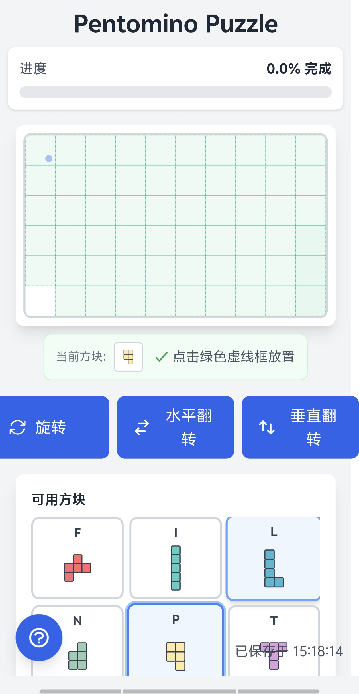

# Pento - A Pentomino Puzzle Game

A single-player pentomino puzzle game built with Phoenix LiveView, featuring smart placement algorithms and game state persistence.

[中文版本](README_zh.md)

## About the Game

Pento is a classic pentomino puzzle game where players must fit 12 unique pieces onto a game board. Each pentomino piece is made up of 5 connected squares and is named after letters they resemble (F, I, L, N, P, T, U, V, W, X, Y, Z).

The challenge lies in finding the right combination of piece placements, rotations, and flips to completely fill the board without any gaps or overlaps.


## Features

- **Smart Placement Algorithm**: Intelligent piece placement with automatic valid position detection
- **Intuitive Controls**: Click to select, drag to preview, click to place
- **Piece Manipulation**: Rotate and flip pieces with keyboard shortcuts
- **Undo/Redo**: Full move history with undo functionality (Ctrl+Z)
- **Game State Persistence**: Automatic saving and resume after disconnection
- **Responsive Design**: Works seamlessly on desktop and mobile devices
- **Visual Feedback**: Clear indicators for valid/invalid placements

## Tech Stack

- **Elixir/Phoenix**: Backend framework
- **Phoenix LiveView**: Real-time UI updates without JavaScript
- **PostgreSQL**: Database for game state persistence
- **Tailwind CSS**: Styling framework

## Getting Started

### Prerequisites

- Elixir 1.14 or later
- PostgreSQL
- Node.js (for assets)

### Installation

1. Clone the repository:
```bash
git clone git@github.com:biantaishabi2/pento.git
cd pento
```

2. Install dependencies:
```bash
mix deps.get
```

3. Create and migrate your database:
```bash
mix ecto.setup
```

4. Install Node.js dependencies:
```bash
cd assets && npm install
```

5. Start Phoenix server:
```bash
mix phx.server
```

Now you can visit [`localhost:4000`](http://localhost:4000) from your browser.

## How to Play

### Objective
Fill the entire board with all 12 pentomino pieces. The game is won when 100% of the board is covered with no gaps or overlaps.

### Basic Gameplay
1. **Select a Piece**: Click on any piece from the palette on the right side
2. **Preview Placement**: Move your mouse over the board to see where the piece will be placed
3. **Place the Piece**: Click on a valid position (highlighted in green) to place the piece
4. **Adjust as Needed**: Remove pieces by clicking on them, or use undo to revert moves



### Controls
| Action | Mouse | Keyboard |
|--------|-------|-----------|
| Select piece | Click piece in palette | - |
| Place piece | Click on board | - |
| Remove piece | Click placed piece | - |
| Rotate clockwise | - | R |
| Rotate counter-clockwise | - | Shift + R |
| Flip horizontal | - | F |
| Flip vertical | - | Shift + F |
| Undo last move | - | Ctrl + Z |
| Show help | - | H |
| Reset game | Click reset button | - |

### Visual Indicators
- **Green Highlight**: Valid placement position
- **Red Preview**: Invalid placement (overlapping or out of bounds)
- **Ghost Piece**: Semi-transparent preview of where the piece will be placed
- **Progress Bar**: Shows percentage of board filled

### Tips for Success
1. Start with corner pieces and edges - they have fewer placement options
2. Leave the more flexible pieces (like I and L) for later
3. Use the undo feature to experiment with different configurations
4. Pay attention to gaps that match specific piece shapes
5. The game automatically saves your progress, so you can take breaks


## Development

### Running Tests

```bash
mix test
```

### Code Formatting

```bash
mix format
```

## Deployment

The game can be deployed using systemd service. A sample service file is included:

```bash
sudo cp pento.service /etc/systemd/system/
sudo systemctl enable pento
sudo systemctl start pento
```

## Contributing

Contributions are welcome! Please feel free to submit a Pull Request.

## License

This project is licensed under the MIT License.