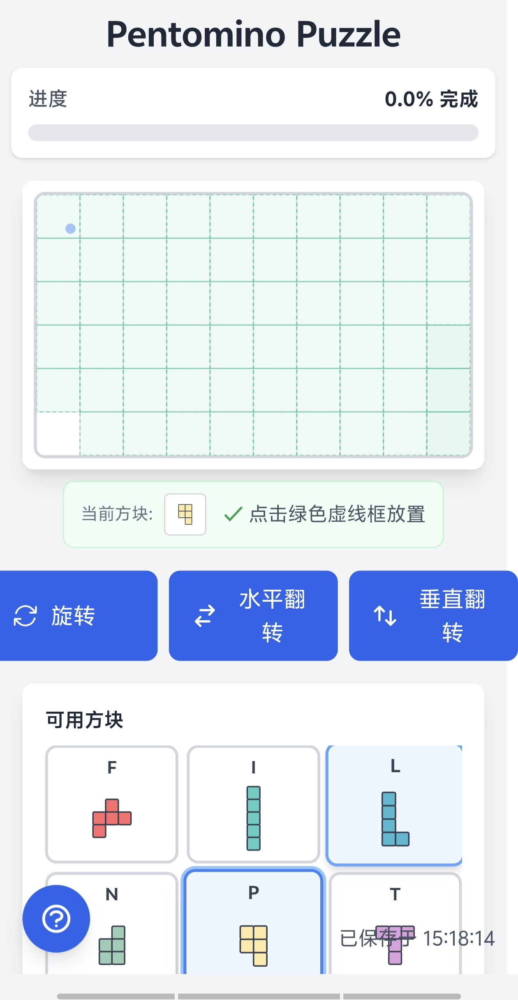

# Pento - 五格拼图游戏

一款基于 Phoenix LiveView 构建的单人五格拼图游戏，具有智能放置算法和游戏状态持久化功能。

[English Version](README.md)

## 游戏介绍

Pento 是一款经典的五格拼图游戏，玩家需要将 12 个独特的拼图块放置到游戏板上。每个五格拼图块由 5 个相连的方格组成，并根据它们的形状命名为字母（F、I、L、N、P、T、U、V、W、X、Y、Z）。

游戏的挑战在于找到正确的拼图块组合、旋转和翻转方式，以完全填满游戏板，不留任何空隙或重叠。


## 功能特性

- **智能放置算法**：智能拼图块放置，自动检测有效位置
- **直观控制**：点击选择，拖动预览，点击放置
- **拼图块操作**：支持旋转和翻转，配有快捷键
- **撤销/重做**：完整的移动历史记录，支持撤销功能（Ctrl+Z）
- **游戏状态持久化**：自动保存，断线后可恢复游戏
- **响应式设计**：完美支持桌面和移动设备
- **视觉反馈**：清晰的有效/无效放置指示

## 技术栈

- **Elixir/Phoenix**：后端框架
- **Phoenix LiveView**：无需 JavaScript 的实时 UI 更新
- **PostgreSQL**：游戏状态持久化数据库
- **Tailwind CSS**：样式框架

## 快速开始

### 系统要求

- Elixir 1.14 或更高版本
- PostgreSQL
- Node.js（用于前端资源）

### 安装步骤

1. 克隆仓库：
```bash
git clone git@github.com:biantaishabi2/pento.git
cd pento
```

2. 安装依赖：
```bash
mix deps.get
```

3. 创建并迁移数据库：
```bash
mix ecto.setup
```

4. 安装 Node.js 依赖：
```bash
cd assets && npm install
```

5. 启动 Phoenix 服务器：
```bash
mix phx.server
```

现在您可以在浏览器中访问 [`localhost:4000`](http://localhost:4000)。

## 游戏玩法

### 游戏目标
使用全部 12 个五格拼图块填满整个游戏板。当游戏板 100% 被填满且没有空隙或重叠时，游戏胜利。

### 基本玩法
1. **选择拼图块**：点击右侧调色板中的任意拼图块
2. **预览放置**：将鼠标移动到游戏板上，查看拼图块的放置位置
3. **放置拼图块**：点击有效位置（绿色高亮）放置拼图块
4. **调整布局**：点击已放置的拼图块将其移除，或使用撤销功能回退操作



### 操作控制
| 操作 | 鼠标 | 键盘 |
|------|------|------|
| 选择拼图块 | 点击调色板中的拼图块 | - |
| 放置拼图块 | 点击游戏板 | - |
| 移除拼图块 | 点击已放置的拼图块 | - |
| 顺时针旋转 | - | R |
| 逆时针旋转 | - | Shift + R |
| 水平翻转 | - | F |
| 垂直翻转 | - | Shift + F |
| 撤销上一步 | - | Ctrl + Z |
| 显示帮助 | - | H |
| 重置游戏 | 点击重置按钮 | - |

### 视觉提示
- **绿色高亮**：有效的放置位置
- **红色预览**：无效的放置（重叠或超出边界）
- **半透明拼图块**：显示拼图块将要放置的位置
- **进度条**：显示游戏板填充的百分比

### 游戏技巧
1. 先从角落和边缘的拼图块开始 - 它们的放置选项较少
2. 将更灵活的拼图块（如 I 和 L）留到后面
3. 使用撤销功能尝试不同的配置组合
4. 注意与特定拼图块形状匹配的空隙
5. 游戏会自动保存进度，可以随时休息


## 开发

### 运行测试

```bash
mix test
```

### 代码格式化

```bash
mix format
```

## 部署

可以使用 systemd 服务部署游戏。项目中包含了示例服务文件：

```bash
sudo cp pento.service /etc/systemd/system/
sudo systemctl enable pento
sudo systemctl start pento
```

## 贡献

欢迎贡献！请随时提交 Pull Request。

## 许可证

本项目采用 MIT 许可证。