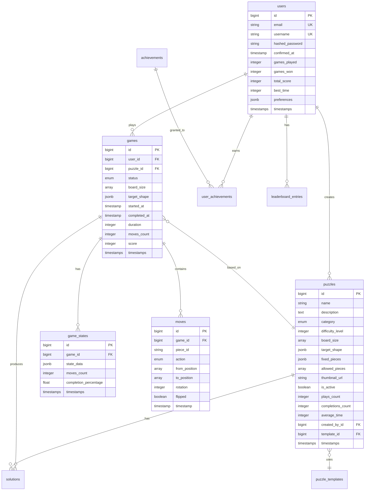

# Pentomino 游戏后端上下文和数据库设计

## 1. 上下文设计 (Context Design)

### 1.1 上下文划分
```elixir
# 领域上下文结构
lib/pentomino/
  accounts/          # 用户账户上下文
    user.ex
    user_token.ex
    
  games/             # 游戏核心上下文
    game.ex
    game_state.ex
    move.ex
    
  puzzles/           # 拼图/关卡上下文
    puzzle.ex
    puzzle_template.ex
    solution.ex
    
  achievements/      # 成就系统上下文
    achievement.ex
    user_achievement.ex
    
  leaderboards/      # 排行榜上下文
    leaderboard_entry.ex
    
  # 上下文模块
  accounts.ex
  games.ex
  puzzles.ex
  achievements.ex
  leaderboards.ex
```

### 1.2 Accounts 上下文
```elixir
# lib/pentomino/accounts.ex
defmodule Pentomino.Accounts do
  @moduledoc """
  用户账户管理上下文
  """
  import Ecto.Query
  alias Pentomino.Repo
  alias Pentomino.Accounts.{User, UserToken}
  
  # 用户注册
  def register_user(attrs) do
    %User{}
    |> User.registration_changeset(attrs)
    |> Repo.insert()
  end
  
  # 获取用户游戏统计
  def get_user_stats(user_id) do
    User
    |> where(id: ^user_id)
    |> preload([:games, :achievements])
    |> Repo.one()
    |> calculate_stats()
  end
  
  defp calculate_stats(user) do
    %{
      total_games: length(user.games),
      completed_games: Enum.count(user.games, & &1.completed),
      total_time: Enum.sum(Enum.map(user.games, & &1.duration)),
      achievements_count: length(user.achievements)
    }
  end
end

# lib/pentomino/accounts/user.ex
defmodule Pentomino.Accounts.User do
  use Ecto.Schema
  import Ecto.Changeset
  
  schema "users" do
    field :email, :string
    field :username, :string
    field :password, :string, virtual: true
    field :hashed_password, :string
    field :confirmed_at, :naive_datetime
    
    # 统计字段
    field :games_played, :integer, default: 0
    field :games_won, :integer, default: 0
    field :total_score, :integer, default: 0
    field :best_time, :integer  # 秒
    
    # 偏好设置
    field :preferences, :map, default: %{
      "theme" => "light",
      "sound_enabled" => true,
      "auto_save" => true
    }
    
    # 关联
    has_many :games, Pentomino.Games.Game
    has_many :achievements, Pentomino.Achievements.UserAchievement
    has_many :leaderboard_entries, Pentomino.Leaderboards.LeaderboardEntry
    
    timestamps()
  end
  
  def registration_changeset(user, attrs) do
    user
    |> cast(attrs, [:email, :username, :password])
    |> validate_required([:email, :username, :password])
    |> validate_email()
    |> validate_username()
    |> validate_password()
    |> hash_password()
  end
  
  defp validate_username(changeset) do
    changeset
    |> validate_length(:username, min: 3, max: 20)
    |> validate_format(:username, ~r/^[a-zA-Z0-9_-]+$/)
    |> unsafe_validate_unique(:username, Pentomino.Repo)
    |> unique_constraint(:username)
  end
end
```

### 1.3 Games 上下文
```elixir
# lib/pentomino/games.ex
defmodule Pentomino.Games do
  @moduledoc """
  游戏核心逻辑上下文
  """
  import Ecto.Query
  alias Pentomino.Repo
  alias Pentomino.Games.{Game, GameState, Move}
  alias Pentomino.Puzzles
  
  # 创建新游戏
  def create_game(user, puzzle_id) do
    puzzle = Puzzles.get_puzzle!(puzzle_id)
    
    %Game{}
    |> Game.changeset(%{
      user_id: user.id,
      puzzle_id: puzzle.id,
      board_size: puzzle.board_size,
      target_shape: puzzle.target_shape
    })
    |> Repo.insert()
    |> case do
      {:ok, game} ->
        # 创建初始游戏状态
        create_initial_state(game)
        {:ok, game}
        
      error -> error
    end
  end
  
  # 保存游戏状态
  def save_game_state(game_id, state_data) do
    %GameState{}
    |> GameState.changeset(%{
      game_id: game_id,
      state_data: state_data,
      moves_count: calculate_moves(state_data),
      completion_percentage: calculate_completion(state_data)
    })
    |> Repo.insert()
  end
  
  # 记录移动
  def record_move(game_id, move_data) do
    %Move{}
    |> Move.changeset(%{
      game_id: game_id,
      piece_id: move_data.piece_id,
      from_position: move_data.from,
      to_position: move_data.to,
      action: move_data.action,
      timestamp: DateTime.utc_now()
    })
    |> Repo.insert()
  end
  
  # 完成游戏
  def complete_game(game_id) do
    game = get_game!(game_id)
    
    Repo.transaction(fn ->
      # 更新游戏状态
      game
      |> Game.complete_changeset()
      |> Repo.update!()
      
      # 更新用户统计
      update_user_stats(game.user_id, game)
      
      # 检查成就
      check_achievements(game)
      
      # 更新排行榜
      update_leaderboard(game)
    end)
  end
  
  # 获取游戏历史
  def get_game_history(game_id, limit \\ 10) do
    GameState
    |> where(game_id: ^game_id)
    |> order_by(desc: :inserted_at)
    |> limit(^limit)
    |> Repo.all()
  end
  
  # 获取用户的活跃游戏
  def get_active_games(user_id) do
    Game
    |> where([g], g.user_id == ^user_id and is_nil(g.completed_at))
    |> order_by(desc: :updated_at)
    |> preload(:puzzle)
    |> Repo.all()
  end
end

# lib/pentomino/games/game.ex
defmodule Pentomino.Games.Game do
  use Ecto.Schema
  import Ecto.Changeset
  
  schema "games" do
    field :status, Ecto.Enum, values: [:playing, :completed, :abandoned], default: :playing
    field :board_size, {:array, :integer}  # [width, height]
    field :target_shape, :map  # 可选：目标形状
    field :started_at, :utc_datetime
    field :completed_at, :utc_datetime
    field :duration, :integer  # 秒
    field :moves_count, :integer, default: 0
    field :score, :integer, default: 0
    
    belongs_to :user, Pentomino.Accounts.User
    belongs_to :puzzle, Pentomino.Puzzles.Puzzle
    has_many :game_states, Pentomino.Games.GameState
    has_many :moves, Pentomino.Games.Move
    
    timestamps()
  end
  
  def changeset(game, attrs) do
    game
    |> cast(attrs, [:user_id, :puzzle_id, :board_size, :target_shape])
    |> validate_required([:user_id, :board_size])
    |> put_change(:started_at, DateTime.utc_now())
  end
  
  def complete_changeset(game) do
    duration = DateTime.diff(DateTime.utc_now(), game.started_at)
    
    game
    |> change(%{
      status: :completed,
      completed_at: DateTime.utc_now(),
      duration: duration,
      score: calculate_score(game, duration)
    })
  end
  
  defp calculate_score(game, duration) do
    base_score = 1000
    time_bonus = max(0, 600 - duration) * 2  # 10分钟内完成有奖励
    move_bonus = max(0, 100 - game.moves_count) * 5  # 移动次数少有奖励
    
    base_score + time_bonus + move_bonus
  end
end

# lib/pentomino/games/game_state.ex
defmodule Pentomino.Games.GameState do
  use Ecto.Schema
  import Ecto.Changeset
  
  schema "game_states" do
    field :state_data, :map  # 完整的游戏状态快照
    field :moves_count, :integer
    field :completion_percentage, :float
    
    belongs_to :game, Pentomino.Games.Game
    
    timestamps()
  end
  
  def changeset(game_state, attrs) do
    game_state
    |> cast(attrs, [:game_id, :state_data, :moves_count, :completion_percentage])
    |> validate_required([:game_id, :state_data])
    |> validate_state_data()
  end
  
  defp validate_state_data(changeset) do
    validate_change(changeset, :state_data, fn :state_data, state_data ->
      required_keys = ["placed_pieces", "available_pieces", "board_size"]
      
      if Enum.all?(required_keys, &Map.has_key?(state_data, &1)) do
        []
      else
        [state_data: "缺少必要的状态数据"]
      end
    end)
  end
end

# lib/pentomino/games/move.ex
defmodule Pentomino.Games.Move do
  use Ecto.Schema
  import Ecto.Changeset
  
  schema "moves" do
    field :piece_id, :string
    field :action, Ecto.Enum, values: [:place, :remove, :rotate, :flip]
    field :from_position, {:array, :integer}  # [x, y]
    field :to_position, {:array, :integer}    # [x, y]
    field :rotation, :integer  # 0, 90, 180, 270
    field :flipped, :boolean, default: false
    field :timestamp, :utc_datetime
    
    belongs_to :game, Pentomino.Games.Game
    
    timestamps()
  end
end
```

### 1.4 Puzzles 上下文
```elixir
# lib/pentomino/puzzles.ex
defmodule Pentomino.Puzzles do
  @moduledoc """
  拼图/关卡管理上下文
  """
  import Ecto.Query
  alias Pentomino.Repo
  alias Pentomino.Puzzles.{Puzzle, PuzzleTemplate, Solution}
  
  # 获取所有可用拼图
  def list_puzzles(opts \\ []) do
    difficulty = Keyword.get(opts, :difficulty)
    category = Keyword.get(opts, :category)
    
    Puzzle
    |> filter_by_difficulty(difficulty)
    |> filter_by_category(category)
    |> order_by(asc: :difficulty_level, asc: :name)
    |> Repo.all()
  end
  
  # 创建自定义拼图
  def create_custom_puzzle(user_id, attrs) do
    %Puzzle{}
    |> Puzzle.changeset(Map.put(attrs, :created_by_id, user_id))
    |> Repo.insert()
  end
  
  # 验证解决方案
  def validate_solution(puzzle_id, placed_pieces) do
    puzzle = get_puzzle!(puzzle_id)
    
    cond do
      has_target_shape?(puzzle) ->
        validate_target_shape(puzzle, placed_pieces)
        
      true ->
        validate_full_coverage(puzzle, placed_pieces)
    end
  end
  
  # 记录解决方案
  def save_solution(game_id, puzzle_id, solution_data) do
    %Solution{}
    |> Solution.changeset(%{
      puzzle_id: puzzle_id,
      game_id: game_id,
      solution_data: solution_data,
      is_optimal: check_if_optimal(solution_data)
    })
    |> Repo.insert()
  end
  
  # 获取拼图的最佳解决方案
  def get_best_solutions(puzzle_id, limit \\ 10) do
    Solution
    |> where(puzzle_id: ^puzzle_id)
    |> join(:inner, [s], g in assoc(s, :game))
    |> order_by([s, g], asc: g.duration, asc: g.moves_count)
    |> limit(^limit)
    |> preload(game: :user)
    |> Repo.all()
  end
end

# lib/pentomino/puzzles/puzzle.ex
defmodule Pentomino.Puzzles.Puzzle do
  use Ecto.Schema
  import Ecto.Changeset
  
  schema "puzzles" do
    field :name, :string
    field :description, :string
    field :category, Ecto.Enum, values: [:classic, :challenge, :custom, :daily]
    field :difficulty_level, :integer  # 1-10
    field :board_size, {:array, :integer}
    field :target_shape, :map  # 可选：需要填充的特定形状
    field :fixed_pieces, {:array, :map}  # 预先放置的方块
    field :allowed_pieces, {:array, :string}  # 允许使用的方块ID列表
    field :thumbnail_url, :string
    field :is_active, :boolean, default: true
    
    # 统计
    field :plays_count, :integer, default: 0
    field :completions_count, :integer, default: 0
    field :average_time, :integer  # 平均完成时间（秒）
    
    belongs_to :created_by, Pentomino.Accounts.User
    belongs_to :template, Pentomino.Puzzles.PuzzleTemplate
    has_many :games, Pentomino.Games.Game
    has_many :solutions, Pentomino.Puzzles.Solution
    
    timestamps()
  end
  
  def changeset(puzzle, attrs) do
    puzzle
    |> cast(attrs, [:name, :description, :category, :difficulty_level, 
                    :board_size, :target_shape, :fixed_pieces, :allowed_pieces])
    |> validate_required([:name, :category, :difficulty_level, :board_size])
    |> validate_number(:difficulty_level, greater_than: 0, less_than_or_equal_to: 10)
    |> validate_board_size()
    |> validate_pieces()
  end
  
  defp validate_board_size(changeset) do
    validate_change(changeset, :board_size, fn :board_size, [width, height] ->
      if width > 0 and height > 0 and width * height >= 60 do
        []
      else
        [board_size: "棋盘必须至少容纳60个格子"]
      end
    end)
  end
end
```

## 2. 数据库设计

### 2.1 数据库架构图


### 2.2 数据库迁移文件

```elixir
# priv/repo/migrations/001_create_users.exs
defmodule Pentomino.Repo.Migrations.CreateUsers do
  use Ecto.Migration

  def change do
    create table(:users) do
      add :email, :string, null: false
      add :username, :string, null: false
      add :hashed_password, :string, null: false
      add :confirmed_at, :naive_datetime
      
      # 统计字段
      add :games_played, :integer, default: 0
      add :games_won, :integer, default: 0
      add :total_score, :integer, default: 0
      add :best_time, :integer
      
      # JSONB for preferences
      add :preferences, :map, default: %{}
      
      timestamps()
    end
    
    create unique_index(:users, [:email])
    create unique_index(:users, [:username])
    create index(:users, [:total_score])  # 用于排行榜
  end
end

# priv/repo/migrations/002_create_puzzles.exs
defmodule Pentomino.Repo.Migrations.CreatePuzzles do
  use Ecto.Migration

  def change do
    # 创建枚举类型
    execute "CREATE TYPE puzzle_category AS ENUM ('classic', 'challenge', 'custom', 'daily')"
    
    create table(:puzzles) do
      add :name, :string, null: false
      add :description, :text
      add :category, :puzzle_category, null: false
      add :difficulty_level, :integer, null: false
      add :board_size, {:array, :integer}, null: false
      add :target_shape, :map
      add :fixed_pieces, {:array, :map}, default: []
      add :allowed_pieces, {:array, :string}, default: []
      add :thumbnail_url, :string
      add :is_active, :boolean, default: true
      
      # 统计
      add :plays_count, :integer, default: 0
      add :completions_count, :integer, default: 0
      add :average_time, :integer
      
      # 关联
      add :created_by_id, references(:users, on_delete: :nilify_all)
      add :template_id, references(:puzzle_templates, on_delete: :nilify_all)
      
      timestamps()
    end
    
    create index(:puzzles, [:category, :difficulty_level])
    create index(:puzzles, [:is_active])
    create index(:puzzles, [:created_by_id])
  end
  
  def down do
    drop table(:puzzles)
    execute "DROP TYPE puzzle_category"
  end
end

# priv/repo/migrations/003_create_games.exs
defmodule Pentomino.Repo.Migrations.CreateGames do
  use Ecto.Migration

  def change do
    execute "CREATE TYPE game_status AS ENUM ('playing', 'completed', 'abandoned')"
    
    create table(:games) do
      add :user_id, references(:users, on_delete: :delete_all), null: false
      add :puzzle_id, references(:puzzles, on_delete: :nilify_all)
      add :status, :game_status, default: "playing"
      add :board_size, {:array, :integer}, null: false
      add :target_shape, :map
      add :started_at, :utc_datetime, null: false
      add :completed_at, :utc_datetime
      add :duration, :integer
      add :moves_count, :integer, default: 0
      add :score, :integer, default: 0
      
      timestamps()
    end
    
    create index(:games, [:user_id, :status])
    create index(:games, [:puzzle_id])
    create index(:games, [:score])  # 用于排行榜查询
    
    # 为了高效查询用户的活跃游戏
    create index(:games, [:user_id, :completed_at], 
      where: "completed_at IS NULL",
      name: :active_games_index)
  end
  
  def down do
    drop table(:games)
    execute "DROP TYPE game_status"
  end
end

# priv/repo/migrations/004_create_game_states.exs
defmodule Pentomino.Repo.Migrations.CreateGameStates do
  use Ecto.Migration

  def change do
    create table(:game_states) do
      add :game_id, references(:games, on_delete: :delete_all), null: false
      add :state_data, :map, null: false
      add :moves_count, :integer
      add :completion_percentage, :float
      
      timestamps()
    end
    
    create index(:game_states, [:game_id, :inserted_at])
  end
end

# priv/repo/migrations/005_create_moves.exs
defmodule Pentomino.Repo.Migrations.CreateMoves do
  use Ecto.Migration

  def change do
    execute "CREATE TYPE move_action AS ENUM ('place', 'remove', 'rotate', 'flip')"
    
    create table(:moves) do
      add :game_id, references(:games, on_delete: :delete_all), null: false
      add :piece_id, :string, null: false
      add :action, :move_action, null: false
      add :from_position, {:array, :integer}
      add :to_position, {:array, :integer}
      add :rotation, :integer
      add :flipped, :boolean, default: false
      add :timestamp, :utc_datetime, null: false
      
      timestamps()
    end
    
    create index(:moves, [:game_id, :timestamp])
  end
  
  def down do
    drop table(:moves)
    execute "DROP TYPE move_action"
  end
end

# priv/repo/migrations/006_create_achievements.exs
defmodule Pentomino.Repo.Migrations.CreateAchievements do
  use Ecto.Migration

  def change do
    create table(:achievements) do
      add :name, :string, null: false
      add :description, :text
      add :icon, :string
      add :category, :string
      add :points, :integer, default: 10
      add :criteria, :map, null: false  # {"type": "games_won", "count": 10}
      add :is_active, :boolean, default: true
      
      timestamps()
    end
    
    create unique_index(:achievements, [:name])
    
    create table(:user_achievements) do
      add :user_id, references(:users, on_delete: :delete_all), null: false
      add :achievement_id, references(:achievements, on_delete: :delete_all), null: false
      add :earned_at, :utc_datetime, null: false
      add :game_id, references(:games, on_delete: :nilify_all)
      
      timestamps()
    end
    
    create unique_index(:user_achievements, [:user_id, :achievement_id])
    create index(:user_achievements, [:user_id, :earned_at])
  end
end

# priv/repo/migrations/007_create_leaderboards.exs
defmodule Pentomino.Repo.Migrations.CreateLeaderboards do
  use Ecto.Migration

  def change do
    create table(:leaderboard_entries) do
      add :user_id, references(:users, on_delete: :delete_all), null: false
      add :puzzle_id, references(:puzzles, on_delete: :delete_all)
      add :game_id, references(:games, on_delete: :delete_all)
      add :period_type, :string, null: false  # "daily", "weekly", "monthly", "all_time"
      add :period_date, :date, null: false
      add :score, :integer, null: false
      add :time_seconds, :integer
      add :moves_count, :integer
      add :rank, :integer
      
      timestamps()
    end
    
    # 复合索引用于快速查询排行榜
    create index(:leaderboard_entries, [:period_type, :period_date, :score])
    create index(:leaderboard_entries, [:puzzle_id, :period_type, :period_date, :score])
    create unique_index(:leaderboard_entries, 
      [:user_id, :puzzle_id, :period_type, :period_date],
      name: :unique_user_puzzle_period)
  end
end
```

### 2.3 性能优化考虑

```elixir
# 添加数据库视图用于复杂查询
defmodule Pentomino.Repo.Migrations.CreateDatabaseViews do
  use Ecto.Migration

  def up do
    # 用户排行榜视图
    execute """
    CREATE VIEW user_rankings AS
    SELECT 
      u.id,
      u.username,
      u.total_score,
      u.games_won,
      u.best_time,
      RANK() OVER (ORDER BY u.total_score DESC) as overall_rank,
      RANK() OVER (ORDER BY u.games_won DESC) as wins_rank,
      RANK() OVER (ORDER BY u.best_time ASC NULLS LAST) as speed_rank
    FROM users u
    WHERE u.games_played > 0;
    """
    
    # 拼图统计视图
    execute """
    CREATE MATERIALIZED VIEW puzzle_statistics AS
    SELECT 
      p.id,
      p.name,
      p.difficulty_level,
      COUNT(DISTINCT g.id) as total_plays,
      COUNT(DISTINCT CASE WHEN g.status = 'completed' THEN g.id END) as completions,
      AVG(CASE WHEN g.status = 'completed' THEN g.duration END) as avg_duration,
      MIN(CASE WHEN g.status = 'completed' THEN g.duration END) as best_time
    FROM puzzles p
    LEFT JOIN games g ON p.id = g.puzzle_id
    GROUP BY p.id;
    """
    
    # 创建刷新物化视图的函数
    execute """
    CREATE OR REPLACE FUNCTION refresh_puzzle_statistics()
    RETURNS void AS $$
    BEGIN
      REFRESH MATERIALIZED VIEW CONCURRENTLY puzzle_statistics;
    END;
    $$ LANGUAGE plpgsql;
    """
  end
  
  def down do
    execute "DROP VIEW IF EXISTS user_rankings;"
    execute "DROP MATERIALIZED VIEW IF EXISTS puzzle_statistics;"
    execute "DROP FUNCTION IF EXISTS refresh_puzzle_statistics();"
  end
end
```

### 2.4 Seeds 数据
```elixir
# priv/repo/seeds.exs
alias Pentomino.{Repo, Puzzles, Achievements}

# 创建默认拼图
puzzles = [
  %{
    name: "经典 6x10",
    description: "标准的6x10矩形拼图",
    category: :classic,
    difficulty_level: 5,
    board_size: [10, 6],
    allowed_pieces: ~w[F I L N P T U V W X Y Z]
  },
  %{
    name: "正方形挑战",
    description: "8x8正方形，使用部分方块",
    category: :challenge,
    difficulty_level: 7,
    board_size: [8, 8],
    target_shape: %{
      "cells" => [
        [1,1,1,1,1,1,1,1],
        [1,1,1,1,1,1,1,1],
        [1,1,0,0,0,0,1,1],
        [1,1,0,0,0,0,1,1],
        [1,1,0,0,0,0,1,1],
        [1,1,0,0,0,0,1,1],
        [1,1,1,1,1,1,1,1],
        [1,1,1,1,1,1,1,1]
      ]
    }
  }
]

Enum.each(puzzles, &Puzzles.create_puzzle/1)

# 创建成就
achievements = [
  %{
    name: "初次胜利",
    description: "完成第一个拼图",
    category: "基础",
    points: 10,
    criteria: %{"type" => "games_won", "count" => 1}
  },
  %{
    name: "速度达人",
    description: "在5分钟内完成一个拼图",
    category: "速度",
    points: 50,
    criteria: %{"type" => "time_limit", "seconds" => 300}
  },
  %{
    name: "完美主义者",
    description: "以最少步数完成拼图",
    category: "技巧",
    points: 100,
    criteria: %{"type" => "optimal_solution"}
  }
]

Enum.each(achievements, &Achievements.create_achievement/1)
```

这个设计提供了：

1. **清晰的上下文边界**：每个上下文负责特定的业务领域
2. **完整的数据模型**：支持游戏的所有功能
3. **性能优化**：通过索引、视图和物化视图提高查询效率
4. **可扩展性**：易于添加新功能（如多人游戏、锦标赛等）
5. **数据完整性**：通过外键和约束确保数据一致性
